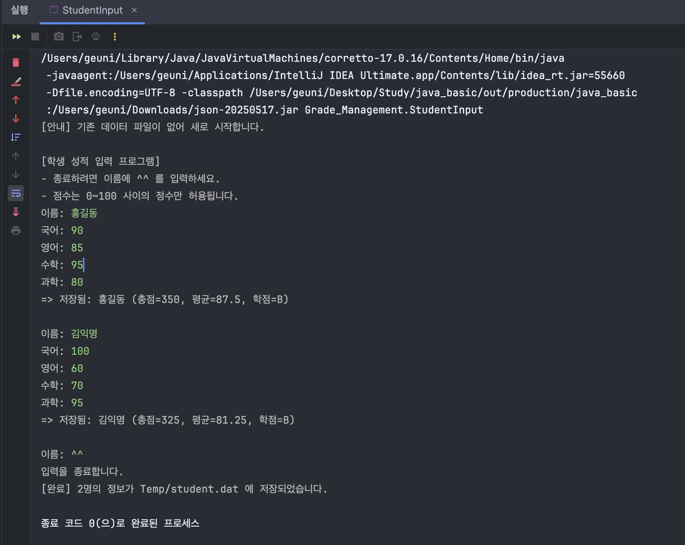
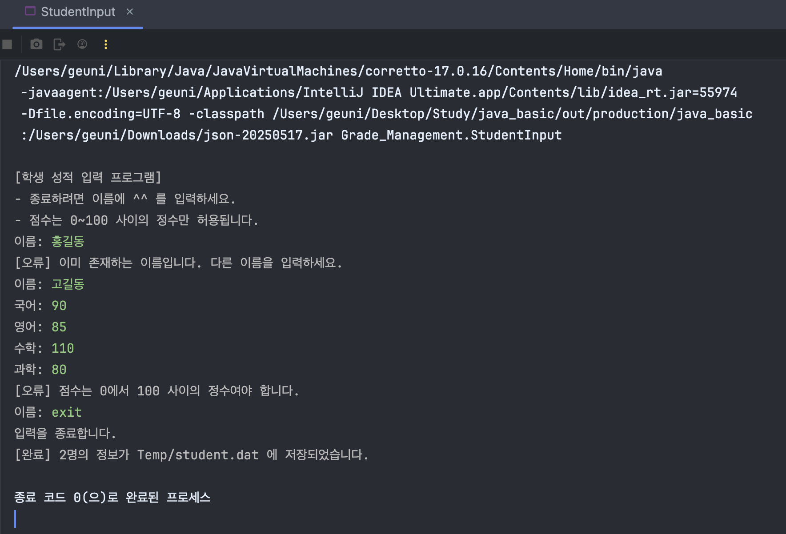
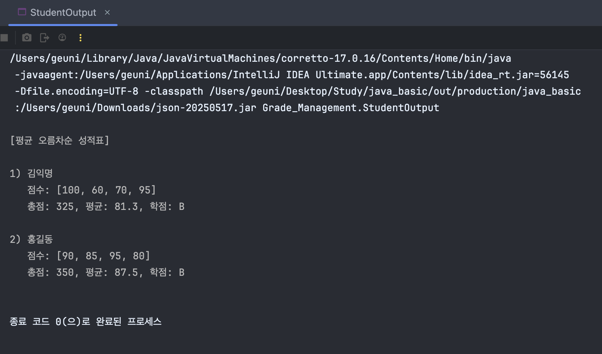
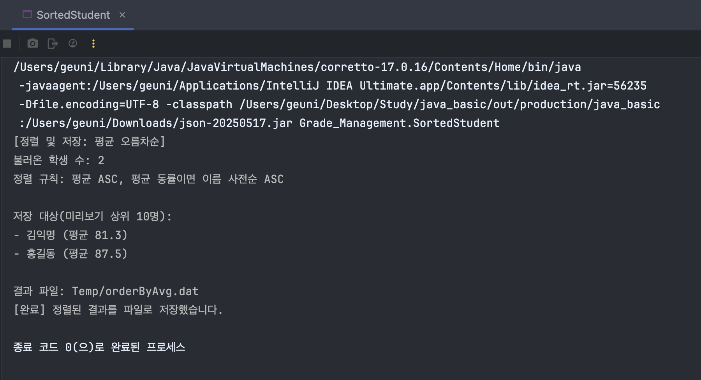

# 학생 성적 관리 시스템

이 프로젝트는 학생들의 성적 정보를 관리하고, 파일 입출력을 통해 데이터를 영구적으로 저장하고 불러오는 자바 애플리케이션입니다. 
사용자로부터 학생 이름과 점수를 입력받아 처리하며, 저장된 데이터는 필요에 따라 정렬하여 볼 수 있습니다.

---

## 주요 기능

-   **학생 정보 입력**: 이름과 4과목(국어, 영어, 수학, 과학) 점수를 입력받습니다.
-   **유효성 검사**: 점수 입력 시 0~100 사이의 정수만 허용하며, 이름 중복을 방지합니다.
-   **자동 통계 계산**: 학생 객체가 생성될 때 총점, 평균, 학점을 자동으로 계산하여 데이터의 일관성을 유지합니다.
-   **데이터 직렬화**: 입력된 학생 객체(`Student`)들을 `HashMap`에 저장하고, 파일(`student.dat`)에 직렬화하여 영구적으로 저장합니다.
-   **데이터 불러오기**: 프로그램 시작 시 기존에 저장된 파일이 있다면 자동으로 데이터를 불러와 이어서 작업할 수 있습니다.
-   **정렬 및 출력**: 저장된 데이터를 평균 점수 기준으로 오름차순 정렬하여 보여줍니다.
-   **정렬 결과 저장**: 정렬된 결과를 별도의 파일(`orderByAvg.dat`)로 저장하여 필요 시 활용할 수 있습니다.

---

## 코드 설명

이 프로젝트는 크게 네 가지 클래스로 구성되어 있습니다.

### `Student.java`

학생 한 명의 정보를 담는 **도메인 클래스**입니다.
-   `Serializable` 인터페이스를 구현하여 객체 직렬화가 가능합니다.
-   `name`, `record`, `total`, `average`, `grade` 등의 멤버 변수로 학생 정보를 저장합니다.
-   생성자에서 `calculateStats()` 메서드를 호출하여 객체 생성 시점에 총점, 평균, 학점을 자동으로 계산합니다.
- 
---

### `StudentInput.java`

사용자로부터 학생 정보를 **입력받는 기능**을 담당하는 메인 클래스입니다.
-   `loadCheck()`: `student.dat` 파일이 존재하는지 확인하고, 존재하면 데이터를 불러옵니다.
-   `checkKeyAndInputData()`: `while` 루프를 사용해 사용자로부터 학생 이름과 점수를 반복해서 입력받습니다. 이름 중복과 점수 유효성을 검사하며, 유효한 데이터만 `Student` 객체로 생성하여 `HashMap`에 저장합니다.
-   `saveData()`: 입력이 완료되면 `HashMap` 전체를 `student.dat` 파일에 직렬화하여 저장합니다.

---

### `StudentOutput.java`

저장된 학생 정보를 불러와서 **화면에 출력**하는 기능을 담당합니다.
-   `loadObjectFromFile()`: `student.dat` 파일에서 `HashMap` 형태의 학생 데이터를 읽어옵니다.
-   `rearrangeData()`: `HashMap`의 `Student` 객체들을 `ArrayList`로 변환하고, `Comparator`와 람다식을 사용해 평균 점수를 기준으로 정렬합니다.
-   `printInfo()`: 정렬된 `ArrayList`를 순회하며 학생들의 성적 정보를 보기 좋게 출력합니다.

---

### `SortedStudent.java`

학생 정보를 정렬하여 **별도의 파일로 저장**하는 기능을 담당합니다.
-   `createTreeSet()`: 평균과 이름으로 정렬하는 `Comparator`를 정의하고, 이를 사용해 `TreeSet`을 생성합니다. `HashMap`의 데이터를 `TreeSet`에 추가하면서 자동 정렬을 수행합니다.
-   `outputObject()`: 정렬된 `TreeSet`을 `ArrayList`로 변환한 후, `orderByAvg.dat` 파일에 직렬화하여 저장합니다.

---

### 실행 결과

학생 성적 데이터 정상 입력 및 저장

학생 성적 오류 입력 화면

저장된 데이터 불러와서 화면 출력

정렬된 데이터를 파일로 저장

